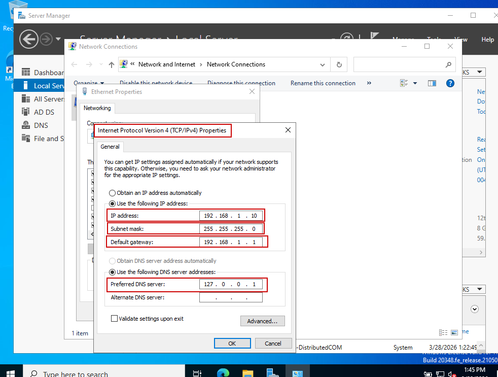
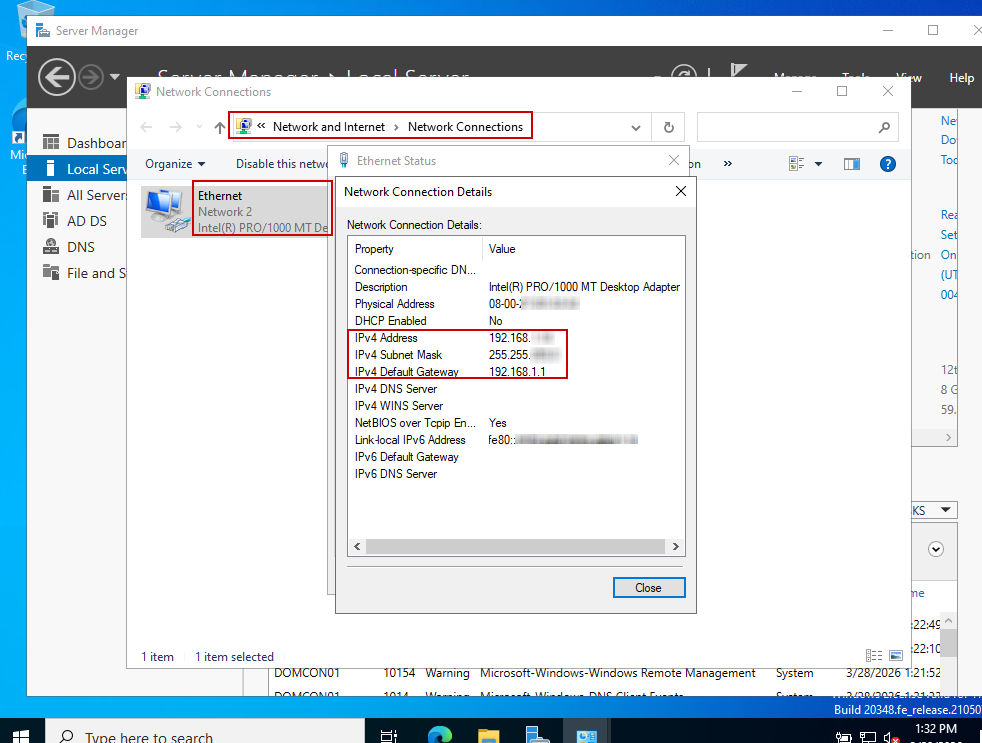
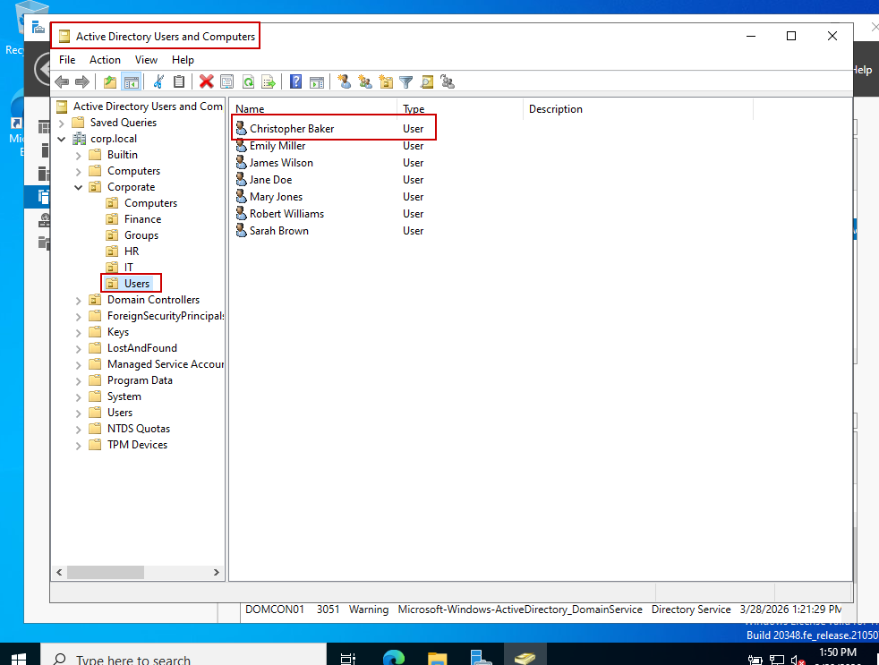
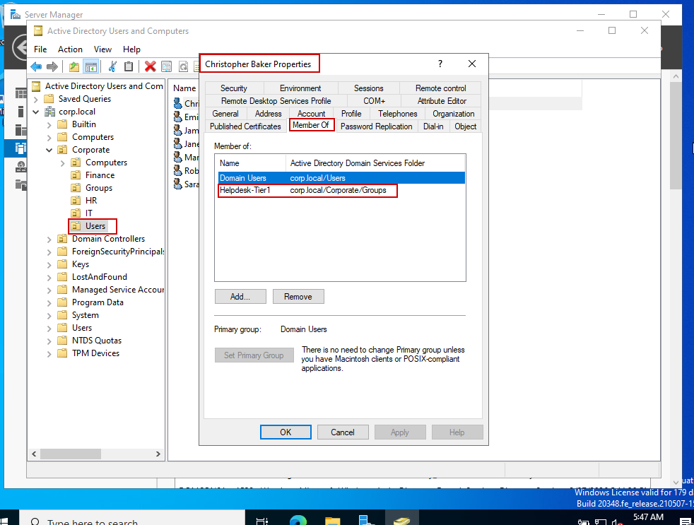
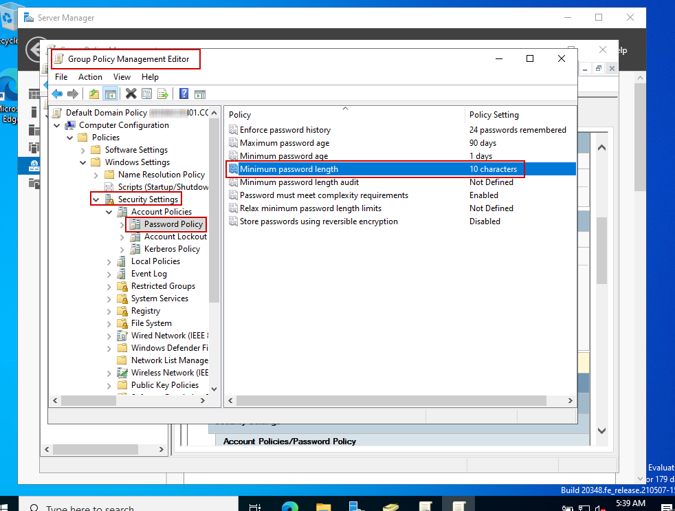
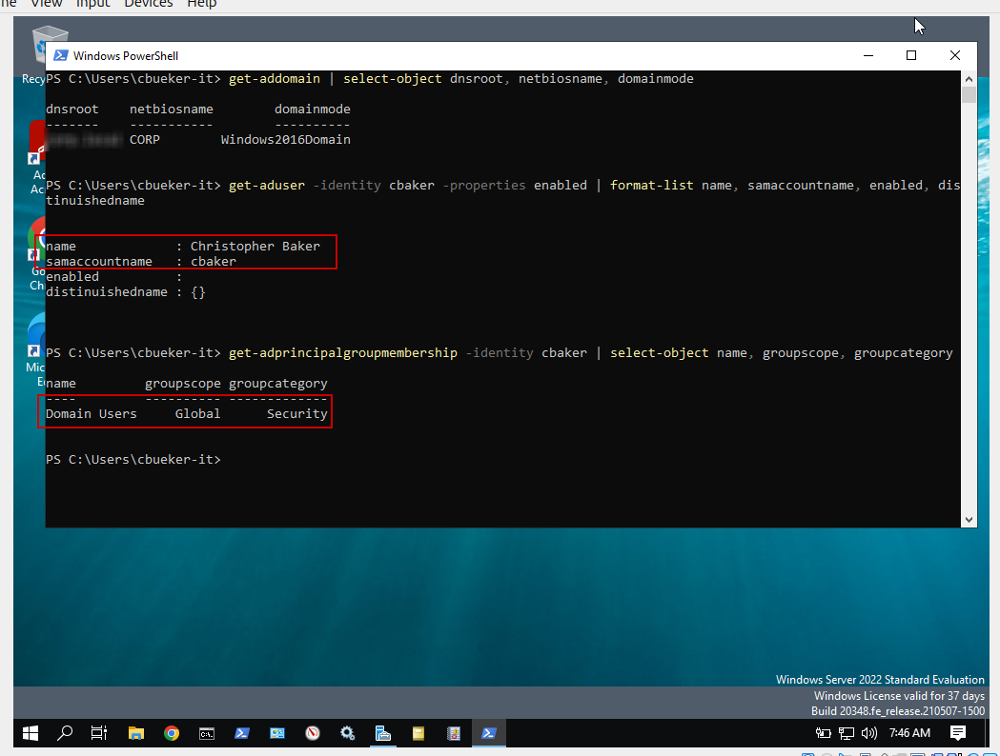
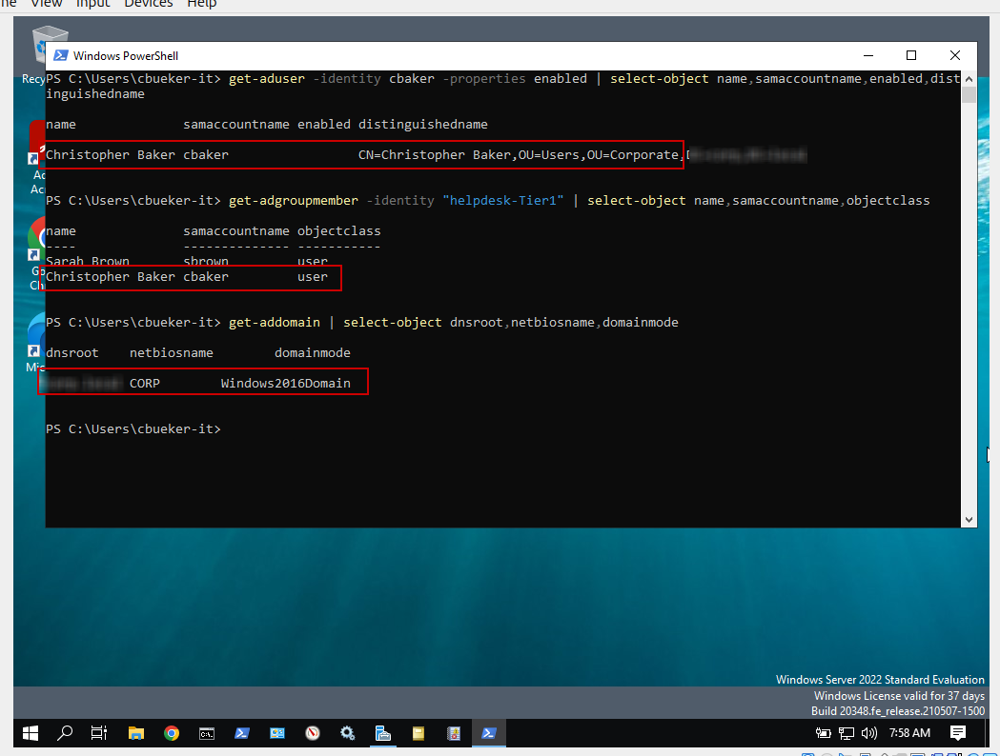

**Active Directory Lab**

I built this hands-on Windows Server lab in Oracle VM VirtualBox to practice fundamental Active Directory administration tasks. My lab shows the domain controller setup, static IP configuration, DNS configuration, organizational unit design, user and group administration, and Group Policy security settings.

Lab Objectives
- Install Windows Server in Oracle VM VirtualBox
- Promote the server to a domain controller
- Configure a static IPv4 address and DNS settings
- Create organizational units for departments
- Create users and groups and assign permissions to each group
- Assign users to a specific group
- Review password policy and account lockout settings

**Static Network Configuration**

- Configured a static IPv4 address for the Windows Server domain controller.
- Defined the subnet mask and default gateway for consistent network connectivity.
- Configured the server to use its local DNS service for Active Directory name resolution.

**Network Configuration Validation**

- Verified that DHCP was disabled and the server was using a static network configuration.
- Confirmed the assigned IPv4 address, subnet mask, and default gateway.
- Validated the active Ethernet adapter configuration through Windows Network Connection Details.

**Active Directory Directory Structure**

- Organized Active Directory objects within the `Corporate` organizational unit.
- Created departmental OUs for Finance, HR, IT, Computers, Groups, and Users.
- Added user accounts to establish a structured directory environment for centralized administration.

**Helpdesk Group Membership**

- Assigned the Christopher Baker user account to the `Helpdesk-Tier1` security group.
- Used security-group membership to support role-based access control rather than assigning permissions directly to individual users.
- Maintained the default `Domain Users` membership while adding the helpdesk role.

**Domain Password Policy**

- Configured password policy through the Default Domain Policy in Group Policy Management.
- Enforced password history, password-age requirements, and a minimum password length.
- Enabled password complexity requirements and disabled reversible password encryption.

**Active Directory User Validation**

- Used PowerShell Active Directory cmdlets to validate domain information and user-account configuration.
- Confirmed the `cbaker` account name and enabled status.
- Queried the user's Active Directory security-group membership from the command line.

**Helpdesk Tier-1 Group Validation**

- Verified the Christopher Baker account and its distinguished Active Directory location with PowerShell.
- Queried the `Helpdesk-Tier1` security group and confirmed its assigned user accounts.
- Validated the Active Directory domain name, NetBIOS name, and domain functional mode.

Skills Practiced
- Windows Server installation
- Active Directory domain services
- DNS configuration
- Static IP assignment
- Organizational unit design
- User and group administration
- Group Policy review

Summary

This lab demonstrates practical Windows Server administration in a virtual environment. It shows how core infrastructure tasks connect across identity, networking, and security management in entry-level systems administration work.

Navigation

[`Back to GitHub Profile`](https://www.github.com/cbueker-it)
